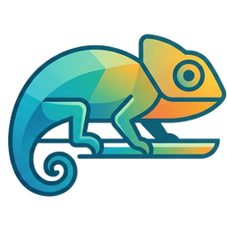

<p align="center">
  
</p>

<h1 align="center">Chameleon</h1>
<p align="center"><em>A goal-oriented AI learning workspace — the UI reshapes itself around what you're trying to learn.</em></p>

---

Tell Chameleon what you want to learn. It builds a **lesson plan** — a visible
checklist of goals you work through and check off — then teaches it: writing
lessons, quizzing you, building flashcard decks, and recording a two-host audio
overview, opening and rearranging those tools on an adaptive grid as you go.
Every result feeds back into the plan, so the experience changes as you learn.

The agent acts **without asking permission** — your control is interruption.
It does **one thing at a time**, narrates inside the app window it's working
in, and the chat history steps aside while it works. Those rules are the
product; they're written down in [CLAUDE.md](CLAUDE.md).

## Run it

```bash
# Node 24+ (node:sqlite). Zero npm dependencies.
cat > .env <<'EOF'
ANTHROPIC_API_KEY=sk-ant-...
ELEVENLABS_API_KEY=sk_...        # optional — podcast audio
EOF
node server.js
# → http://localhost:8787
```

| Env var | Default | Notes |
|---|---|---|
| `ANTHROPIC_API_KEY` | — | required |
| `ELEVENLABS_API_KEY` | — | optional; without it the podcast shows its script but won't speak |
| `CHAMELEON_MODEL` | `claude-opus-5` | the tutor model |
| `CHAMELEON_EFFORT` | API default | `low`…`max` |
| `PORT` | `8787` | |
| `ELEVENLABS_VOICE_A` / `_B` | Rachel / Adam | podcast host voices |

Tests: `node --test "test/*.test.js"` and `node test/solver.test.js`.

## The apps

| App | What it is | Interaction |
|---|---|---|
| **Plan** | the lesson plan: staged checklist + progress ring | check a task → the agent adapts and moves on |
| **Notebook** | your sources: pasted text, fetched links, agent notes | grounding truth — the agent teaches from these |
| **Lesson** | sectioned markdown lesson | click a section → go deeper on exactly that |
| **Quiz** | multiple-choice (auto-graded) + free answers | submit → the agent grades the free ones specifically |
| **Flashcards** | flip deck with got-it/again | clear the deck → ask for a harder one |
| **Podcast** | two-host audio overview | real ElevenLabs voices, per-line synthesis + cache |

## Layout

```
server.js            entry point (→ server/index.js)
server/
  index.js           HTTP: static + /api/* + /demo/*
  env.js  db.js      .env loader · node:sqlite schema
  store.js           sessions, messages, plans, sources, artifacts, attempts
  agent.js           streaming Anthropic tool-use loop, executed server-side
  tools.js           tool schemas + executors (the agent's hands)
  api.js  tts.js     REST/SSE handlers · ElevenLabs + audio cache
public/
  layout.js          grid solver (exact pass, pinning, bend/tuck, growth)
  apps.js            learning-app registry + renderers
  chat.js            the fused composer + history + stop control
  main.js            tiles, drag/resize physics, one-at-a-time action queue
  style.css          the design system
demo/                the FROZEN sales-workspace POC, served at /demo/
docs/ARCHITECTURE.md how it all fits together
```

## Deploying under a sub-path (e.g. `example.com/cmln`)

All asset and API calls are relative, so reverse-proxy a prefix straight to the app:

```nginx
location = /cmln { return 301 /cmln/; }
location /cmln/ {
    proxy_pass http://127.0.0.1:8787/;   # trailing slash strips the prefix
    proxy_http_version 1.1;
    proxy_buffering off;                  # required: /api/chat streams SSE
    proxy_read_timeout 300s;
}
```

## The demo

`/demo/` is the original proof-of-concept: an adaptive **sales** workspace with
a simulated CRM, 14 interlocking tools, and ~430 precomputed routes. It proved
the interaction model that this product is built on — the grid engine, the tile
physics, streamed agent actions. It is frozen: bug reports against it are
wontfix, and no code in the real app imports from it.
